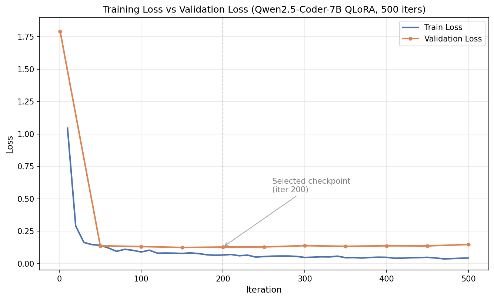

# text2sql — Text-to-SQL 파인튜닝 (QLoRA, MLX)

> Qwen2.5-Coder-7B-Instruct를 QLoRA로 파인튜닝해, 에이전트 실행 로그 조회용 Text-to-SQL 실행 정확도를 **76.7% → 86.7%**로 개선한 프로젝트입니다. (Apple Silicon, MLX-LM 사용)

## 결과 요약

| 모델 | 실행 정확도 (Test 30개) |
|---|---|
| 베이스 모델 (파인튜닝 전) | 76.7% (23/30) |
| **파인튜닝 모델 (iter 200, 최종 채택)** | **86.7% (26/30)** |
| 파인튜닝 모델 (iter 500, 최종 iter) | 83.3% (25/30) |

- Validation Loss는 iter 150~200 부근에서 최적점을 찍고 이후 소폭 상승 → 과적합 시작 구간으로 판단
- 실제 test 성능에서도 `iter 200(86.7%) > iter 500(83.3%)`으로 확인되어, Loss Curve 기반 예측이 실제 성능으로 검증됨 (마지막 체크포인트가 항상 최선은 아님을 직접 확인)

## 환경
- Apple M3 Pro, 18GB RAM
- MLX-LM (QLoRA / LoRA 파인튜닝)
- 베이스 모델: [`mlx-community/Qwen2.5-Coder-7B-Instruct-4bit`](https://huggingface.co/mlx-community/Qwen2.5-Coder-7B-Instruct-4bit)

## 데이터
- 시드 15개(직접 작성) + Claude API 합성 300개 → SQLite 기반 문법/스키마 검증 및 중복 제거 → 288개
- Train 230 / Valid 28 / Test 30
- 정답 SQL이 동일한 문항은 항상 같은 split에 배정해 데이터 누수(data leakage) 방지

## 파이프라인
| 단계 | 스크립트 |
|---|---|
| 1. 시드 데이터 생성 | `scripts/make_seed_data.py` |
| 2. 합성 데이터 생성 (Claude API) | `scripts/generate_synthetic.py` |
| 3. 검증/정제 | `scripts/validate_and_clean.py` |
| 4. Train/Valid/Test 분리 | `scripts/split_data.py` |
| 5. LoRA 파인튜닝 실행 | `scripts/run_training.py` |
| 6. 평가용 샘플 DB 생성 | `scripts/build_test_db.py` |
| 7. 베이스 vs 파인튜닝 성능 비교 | `scripts/evaluate_models.py` |

## 주요 배운 점
- **Loss Curve 해석 → 실제 성능 검증**: Val Loss가 가장 낮은 체크포인트(iter 200)를 선정하고, 이 판단이 test set 실행 정확도에서도 그대로 재현되는지 확인하는 전체 사이클을 직접 수행
- **평가 방법론의 한계 인지**: 실행 정확도(Execution Accuracy) 채점은 SQL의 컬럼 구성까지 정답과 일치해야 하는 엄격한 방식이라, 논리는 맞지만 오답 처리되는 케이스(false negative)가 존재함을 확인
- **모델의 공통 실패 패턴 발견**: "~별로"처럼 암묵적으로 `LEFT JOIN`이 필요한 질문에서, 베이스/파인튜닝 모델 모두 `INNER JOIN`을 기본값으로 선택해 실행 이력이 없는 항목을 결과에서 누락시키는 경향을 실제 데이터로 검증
